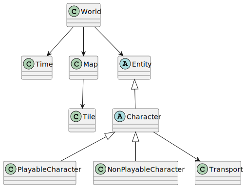

# Sesiones de diseño

Este es el repositorio de las sesiones de diseño de la asignatura de Ingeniería del Software II de UNEATLANTICO.

Se desarrolla, en un caso controlado, la disciplina de diseño, con el objetivo de capacitarnos para la descomposición del trabajo de implementación en piezas manejables, las que serán gestionadas por diferentes equipos de desarrollo, posiblemente al mismo tiempo.

## Proyecto

**Nombre**: PyMundo

## Modelo de Dominio

### Diagrama de Clases

## Modelo de Aplicación

### Diagrama de Clases Prácticas

