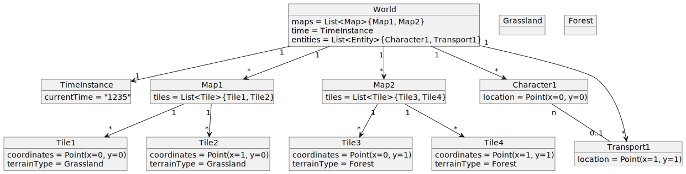

# Sesiones de diseño

Este es el repositorio de las sesiones de diseño de la asignatura de Ingeniería del Software II de UNEATLANTICO.

Se desarrolla, en un caso controlado, la disciplina de diseño, con el objetivo de capacitarnos para la descomposición del trabajo de implementación en piezas manejables, las que serán gestionadas por diferentes equipos de desarrollo, posiblemente al mismo tiempo.

## Proyecto

**Nombre**: PyMundo
=======

## Modelo de Dominio

En esta sección se presentan los diversos diagramas utilizados para conceptualizar y estructurar el modelo de dominio del proyecto PyMundo. Cada diagrama aborda diferentes aspectos del diseño y la estructura del sistema.

### Diagrama de Clases

El Diagrama de Clases proporciona una visión estática del sistema, mostrando las clases que serán utilizadas junto con sus atributos, métodos y las relaciones entre ellas.

### Diagrama de Objetos

El Diagrama de Objetos es una instantánea que muestra cómo las instancias de las clases están relacionadas en un momento específico durante la ejecución del sistema.

### Diagrama de Estados

El Diagrama de Estados ilustra los cambios de estado de los objetos más significativos dentro del sistema a lo largo del tiempo, en respuesta a eventos internos o externos.

## Clases Prácticas

Este diagrama visualiza las interacciones típicas y los flujos de trabajo durante las sesiones prácticas del proyecto, destacando la dinámica de las clases y su aplicabilidad en contextos de aprendizaje real.

