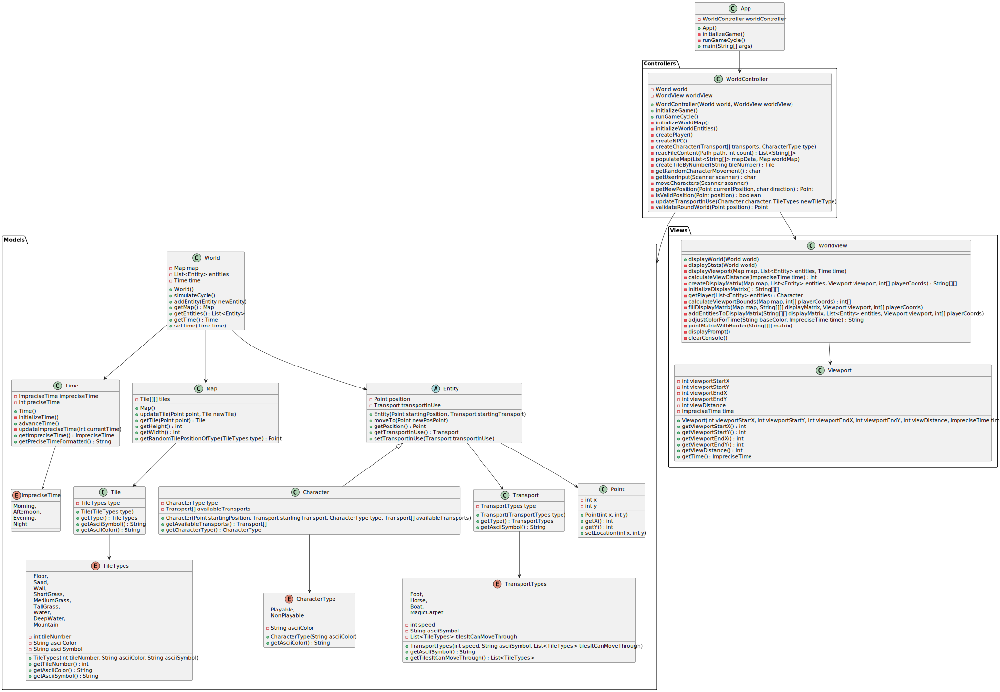

# Sesiones de diseño

Este es el repositorio de las sesiones de diseño de la asignatura de Ingeniería del Software II de UNEATLANTICO.

Se desarrolla, en un caso controlado, la disciplina de diseño, con el objetivo de capacitarnos para la descomposición del trabajo de implementación en piezas manejables, las que serán gestionadas por diferentes equipos de desarrollo, posiblemente al mismo tiempo.

## Proyecto

**Nombre**: PyMundo

## Modelo de Dominio

### Diagrama de Clases

### Diagrama de Objetos

### Diagramas de Estados

#### Estado del Mundo

#### Estado del Mapa

#### Estado del Tiempo

#### Estado del Personaje

#### Estado del Transporte

## Casos de Uso

### Crear Mapa

### Leer Archivo

### Avanzar Tiempo

### Mover Personaje

### Recibir Input de Usuario

### Generar Dirección Aleatoria

### Cambiar Transporte

## Modelo de Aplicación

### Diagrama de Clases Prácticas

