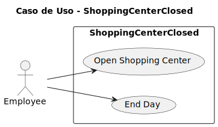
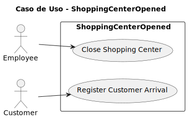
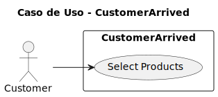
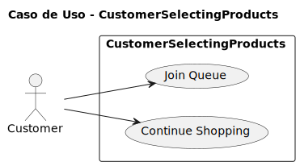
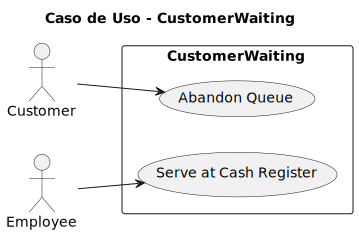
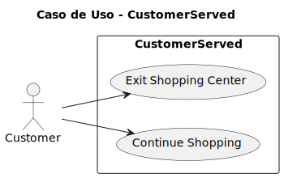
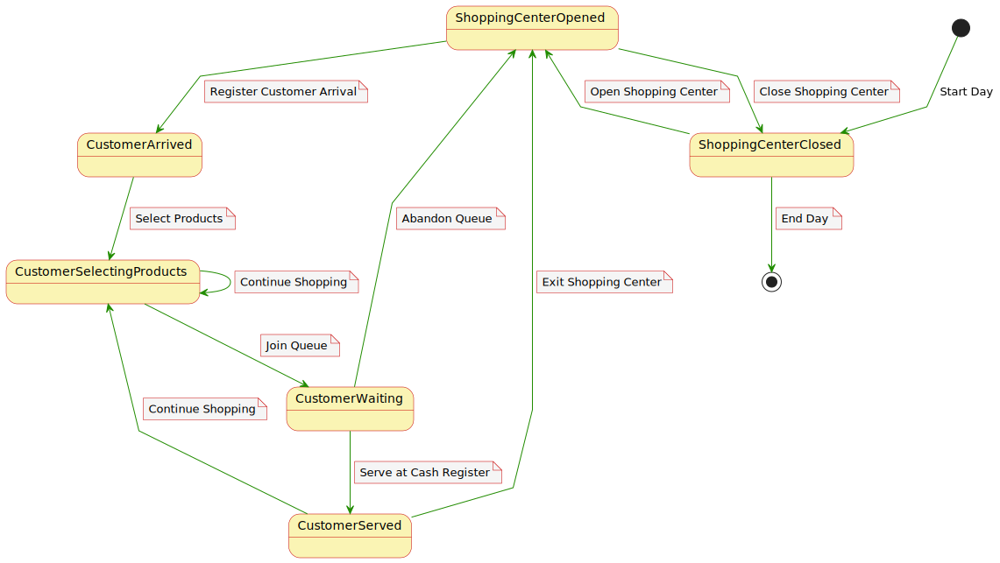

# Casos de Uso

## Índice

1. [Actores y Casos de Uso](#actores-y-casos-de-uso)
2. [Detalles de los Casos de Uso](#detalles-de-los-casos-de-uso)
3. [Diagramas de Contexto](#diagrama-de-contexto)

## Actores y Casos de Uso

### Actores

- Customer
- Employee

### Casos de uso

#### - Shopping Center Closed

|                                               |                                                   |
| --------------------------------------------- | ------------------------------------------------- |
|  | [Código PUML](../casosDeUso/casoUsoSCClosed.puml) |

#### - Shopping Center Opened

|                                               |                                                   |
| --------------------------------------------- | ------------------------------------------------- |
|  | [Código PUML](../casosDeUso/casoUsoSCOpened.puml) |

#### - Customer Arrived

|                                                  |                                                      |
| ------------------------------------------------ | ---------------------------------------------------- |
|  | [Código PUML](../casosDeUso/casoUsoCustArrived.puml) |

#### - Customer Selecting Products

|                                                         |                                                             |
| ------------------------------------------------------- | ----------------------------------------------------------- |
|  | [Código PUML](../casosDeUso/casoUsoCustSelectingProds.puml) |

#### - Customer Waiting

|                                                  |                                                      |
| ------------------------------------------------ | ---------------------------------------------------- |
|  | [Código PUML](../casosDeUso/casoUsoCustWaiting.puml) |

#### - Customer Served

|                                                 |                                                     |
| ----------------------------------------------- | --------------------------------------------------- |
|  | [Código PUML](../casosDeUso/casoUsoCustServed.puml) |

## Diagrama de Contexto

|                                                |                                                    |
| ---------------------------------------------- | -------------------------------------------------- |
|  | [Código PUML](../casosDeUso/diagramaContexto.puml) |
