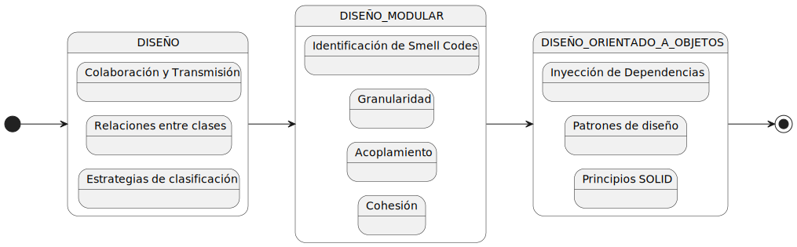

# Memoria del Sistema de Gestión de Centro Comercial

## Tabla de Contenidos

- [Introducción](#introducción)
- [Diseño](#diseño)
  - [Estrategias de Clasificación](#estrategias-de-clasificación)
  - [Relaciones entre clases](#relaciones-entre-clase)
    - [Colaboración](#colaboración)
    - [Transmisión](#transmisión)
  - [Código Limpio](#código-limpio)
- [Diseño Modular](#diseño-modular)
  - [Cohesión](#1-cohesión)
    - [Alternative classes with different interfaces - Clases alternativas con distintas interfaces](#11-alternative-classes-with-different-interfaces)
    - [Features envy - Envidia de características](#12-features-envy---envidia-de-características)
    - [Data class - Clase de datos](#13-data-class---clase-de-datos)
    - [Divergent Change - Cambios divergentes](#14-divergent-change---cambios-divergentes)
    - [Shotgun Surgery - Cirugía a escopetazos](#15-shotgun-surgery---cirugía-a-escopetazos)
    - [Data Clumps - Grupo de datos](#16-data-clumps---grupo-de-datos)
    - [Primitive Obsession - Obsesión por tipos primitivos](#17-primitive-obsession---obsesión-por-tipos-primitivos)
    - [Lazy Classes - Clases perezosas](#18-lazy-classes---clases-perezosas)
  - [Acoplamiento](#2-acoplamiento)
    - [Inappropriate Intimacy - Inapropiada intimidad](#21-inappropriate-intimacy---inapropiada-intimidad)
    - [Incomplete Library Class - Clase de biblioteca incompleta](#22-incomplete-library-class---clase-de-biblioteca-incompleta)
  - [Granulado](#granulado)
    - [Long Parameter List - Listas de parámetros larga](#long-parameter-list---listas-de-parámetros-larga)
    - [Long Method - Métodos largos](#long-method---métodos-largos)
    - [Large Class - Clase grande](#large-class---clase-grande)
    - [Temporary Fields - Campos temporales](#temporary-fields---campos-temporales)
- [Diseño Orientado a Objetos](#diseño-orientado-a-objetos)
  - [Principio de responsabilidad única (SRP)](#principio-de-responsabilidad-única-srp)
  - [Principio de abierto/cerrado (OCP)](#principio-de-abiertocerrado-ocp)
  - [Principio de Sustitución de Liskov (LSP)](#principio-de-sustitución-de-liskov-lsp)
  - [Principio de segregación de interfaces (ISP)](#principio-de-segregación-de-interfaces-isp)
  - [Principio de Inversión de Dependencias (DIP)](#principio-de-inversión-de-dependencias-dip)
- [Conclusión Final](#conclusión-final)

A continuación se presenta el diagrama que ilustra la estructura del proceso de diseño seguido en el desarrollo del sistema. Este diagrama proporciona una visión general y secuencial de las etapas principales del diseño:



## Introducción

Este documento detalla las mejoras implementadas en el Sistema de Gestión de Centro Comercial, destacando el uso de prácticas de diseño modular, código limpio y diseño orientado a objetos para mejorar la mantenibilidad, legibilidad y escalabilidad del sistema.

## Diseño

#### Estrategias de Clasificación

##### Descripción Informal del Problema

El **Centro Comercial** CF, ubicado en El Alisal, opera diariamente desde las 9 de la mañana hasta las 9 de la noche, ofreciendo una variedad de artículos a sus **clientes**. Durante su horario de apertura, el **centro comercial** estima una probabilidad del 40% por minuto de que un **cliente** nuevo entre al supermercado. Los **clientes** pasan entre 5 y 10 minutos seleccionando sus **productos** antes de dirigirse a las **cajas** para pagar. El supermercado comienza con dos **cajas** operativas, pero puede **abrir** hasta un total de seis **cajas** dependiendo del número de **clientes** en **cola**. En cuanto a las **cajas**, estas se abren o cierran según la demanda, si hay más de cinco veces el número de **cajas** abiertas en **cola**, se abre una **caja** adicional, si hay menos, se cierra una. Cada una de estas procesa un **pack** por minuto. A las 8:40 PM, el supermercado deja de admitir **clientes** nuevos y se concentra en **atender** a aquellos en **cola**. Al final del día, se presenta un resumen de la actividad, que incluye datos como el número total de **clientes**, **packs** de ítems procesados, y el número máximo de personas en **cola**.

##### Análisis clásico y modelo de dominio

[Modelo de Dominio](/archivosMd/modelosUml.md)

##### Análisis de comportamiento

- **ShoppingCenter**: Representa el centro comercial. Sus responsabilidades incluyen:
  - **Conocer** las horas de apertura y cierre.
  - **Gestionar** el estado de apertura o cierre.
  - **Administrar** la lista de clientes dentro del centro.
- **CustomerQueue**: Gestiona la cola de clientes esperando para pagar. Sus responsabilidades son:
  - **Conocer y actualizar** la longitud máxima de la cola.
  - **Agregar y remover** clientes de la cola.
- **CashRegister**: Cada caja registradora tiene responsabilidades clave como:
  - **Procesar** a los clientes asignados.
  - **Gestionar** el estado (abierta, cerrada, en descanso).
  - **Coordinar** con el centro de atención para cambios de turno o descansos.
- **AttentionCenter**: Coordina entre las cajas registradoras y la cola de clientes. Es responsable de:
  - **Asignar** clientes a las cajas disponibles.
  - **Manejar** los cambios de turno y descansos de los cajeros.
  - **Cerrar** cajas registradoras según la demanda y el flujo de clientes.
- **DataLog**: Recopila y almacena datos estadísticos del día. Sus tareas incluyen:
  - **Registrar** eventos y transacciones.
  - **Contabilizar** el total de clientes atendidos y productos vendidos.
  - **Presentar** resúmenes estadísticos al final del día.

##### Interacciones y Flujo de Trabajo

- **Inicialización**: El sistema inicia definiendo las cajas registradoras y preparando la configuración inicial de atención al cliente.
- **Simulación Diaria**: A lo largo del día, el sistema actualiza periódicamente el estado del centro comercial y procesa a los clientes que llegan, se mueven a la cola y finalmente son atendidos en las cajas registradoras.
- **Manejo de Eventos Específicos**: Las cajas registradoras y sus cajeros manejan eventos como descansos y cambios de turno basados en el tiempo actual y las políticas del centro comercial.
- **Cierre**: Al final del día, el sistema deja de aceptar nuevos clientes y procesa a todos los clientes restantes antes de cerrar y presentar el resumen del día.

### Relaciones entre clase

#### **Colaboración**

Una de las clases que contiene los 3 elementos de colaboracion es CashRegister.

- **Composición**: La `CashRegister` contiene varios atributos primitivos (`id`, `isOpen`, `isOccupied`, `servedCustomers`, `pendingShiftChange`, `pendingBreak`, `breakCounter`) que representan el estado de la caja registradora. Estos atributos forman parte integral de la `CashRegister`.
- **Agregación**: La `CashRegister` tiene una relación de agregación con `Customer` y `Cashier`. Un `Customer` es asignado temporalmente a una `CashRegister` para ser atendido, y un `Cashier` es asignado para operar la caja registradora. Ambas relaciones son flexibles y los objetos pueden existir independientemente de la `CashRegister`.
- **Asociación**: La `CashRegister` está asociada con `AttentionCenter`, `ShoppingCenter`, `Cashier` y `Customer`. Esta asociación permite que la `CashRegister`: Cambie de cajero a través de `AttentionCenter`.
  Remueva a un cliente del `ShoppingCenter` después de ser atendido.
  Sirva a un `Customer` y sea operada por un `Cashier`

#### **Transmisión**

##### Propuesta de Extensión mediante Herencia

Aunque la herencia no está presente en la versión actual del sistema, se puede mejorar y extender utilizando herencia por extensión. A continuación, se presentan ejemplos de cómo se podría aplicar la herencia para crear diferentes tipos de cajas registradoras.

Podemos extender la clase `CashRegister` para crear tipos específicos de cajas registradoras como `ExpressCashRegister` (para clientes con pocos artículos) y `SelfServiceCashRegister` (para autoservicio).

###### Beneficios de la Herencia por Extensión

- **Reutilización de Código**: La herencia permite reutilizar el código de la clase base `CashRegister`, reduciendo la duplicación de código y facilitando el mantenimiento.
- **Especialización**: Permite crear clases especializadas (`ExpressCashRegister` y `SelfServiceCashRegister`) que extienden la funcionalidad de la clase base con comportamientos específicos.
- **Flexibilidad y Escalabilidad**: Facilita la incorporación de nuevas funcionalidades y tipos de cajas registradoras en el futuro sin alterar la estructura existente.

### Código Limpio

Implementamos mejoras significativas en la base de código para aumentar la legibilidad y mantenibilidad, siguiendo principios de código limpio:

- **Eliminación de Código Muerto**: Se eliminaron bloques de código no utilizados y se depuraron los comentarios obsoletos para clarificar la funcionalidad del sistema.
- **Nombres Descriptivos**: Se revisaron los nombres de variables y métodos para que sean intuitivos y descriptivos, facilitando la comprensión del código.
- **Estructura y Formato Mejorado**: Se ajustó la estructura del código para seguir un estilo consistente y legible, utilizando adecuadamente la indentación y el espaciado.

```java
//Antes
int a = 6; // Límite de 6 cajas registradoras

//Después
int maxCashRegisters = 6;
```

## Diseño Modular

### 1. Cohesión

#### 1.1 Alternative classes with different interfaces

Tras realizar una revisión detallada del código implementado, creemos que no es necesario introducir interfaces. El diseño actual del sistema muestra una clara separación de responsabilidades y una interacción efectiva entre las clases, lo que facilita la extensibilidad y el mantenimiento del código.

##### Clases y Responsabilidades:

- `CashRegister` y `AttentionCenter`: Estas clases gestionan las operaciones en las cajas registradoras y la asignación de clientes a las cajas, respectivamente. Aunque interactúan estrechamente, cada una tiene responsabilidades bien definidas que no se solapan.
- `Customer` y `CustomerQueue`: Customer es una entidad de datos que representa al cliente, mientras que CustomerQueue administra operaciones de cola para grupos de clientes. Las responsabilidades de manejo de datos versus operaciones de cola están bien separadas.
- `DataLog`: Se encarga de la recopilación de estadísticas y el registro de eventos operativos, funcionando como un sistema de logging sin interferir o duplicar funcionalidades de otras clases.
- `Main` y `Time`: Main controla la simulación diaria usando la clase Time para el seguimiento del tiempo. Time sirve exclusivamente para controlar el avance temporal dentro de la simulación.

#### 1.2 Features envy - Envidia de características

El código gestiona principalmente operaciones del centro comercial mediante clases que representan distintos aspectos de un sistema de gestión (ejemplo: clientes, cajeros, registros de cajas). Las clases tienen bien definidas sus responsabilidades, como:

- `CustomerQueue` gestiona la cola de clientes.
- `CashRegister` maneja las operaciones de las cajas registradoras.
- `AttentionCenter` coordina las acciones entre cajas registradoras y la cola de clientes.

No se evidencia un "Features Envy", ya que cada clase maneja sus propios datos y comportamientos adecuadamente.

Ejemplo:

```java
public void assignCustomersToCashRegisters() {
    …
    for (CashRegister cashRegister : cashRegisters) {
        if (cashRegister.isOpen() && !cashRegister.isOccupied() && customerQueue.getSize() > 0) {
            Customer customer = customerQueue.peekCustomer();
            cashRegister.serveCustomer(customer);
            customerQueue.removeCustomer();
        }
    }
}
```

En este fragmento del codigo, `AttentionCenter` no modifica directamente los datos de `CustomerQueue` o `CashRegister`, sino que invoca sus métodos públicos, lo cual es un indicativo de un diseño limpio y modular. Si se observara que métodos de una clase manipulan excesivamente detalles internos de otra, sería necesario reconsiderar la distribución de responsabilidades, posiblemente moviendo métodos o datos para alinear mejor con el principio de responsabilidad única.

#### 1.3 Data class - Clase de datos

Hemos realizado cambios para mejorar la encapsulación y la cohesión del diseño. Es la clase `Customer` la que controla sus propios datos asegurando de que los cambios en sus atributos se hacen internamente, asegurando la modularidad.

**Metodo antes de los cambios:**

```java
   public void processCustomer(ShoppingCenter shoppingCenter) {
        if (this.isOccupied && this.currentCustomer != null) {
            int remainingItems = this.currentCustomer.getNumberOfItemPacks() - 1;
            this.currentCustomer.setNumberOfItemPacks(remainingItems);
            if (remainingItems <= 0) {
                shoppingCenter.removeCustomer(this.currentCustomer);
                finishServingCustomer();
            }
        }
    }

```

**Metodo despues de los cambios:**

```java
public void processCustomer(ShoppingCenter shoppingCenter) {
        if (this.isOccupied && this.currentCustomer != null) {
            this.currentCustomer.reduceNumberOfItemPacks(this.currentCustomer.getNumberOfItemPacks());
            if (this.currentCustomer.getNumberOfItemPacks()<=0) {
                shoppingCenter.removeCustomer(this.currentCustomer);
                finishServingCustomer();
            }
        }
    }
```

**Método nuevo para asegurar la encapsulación:**

```java
   public int reduceNumberOfItemPacks(int numberOfItemPacks) {
        return this.numberOfItemPacks--;
    }
```

#### 1.4 Divergent Change - Cambios divergentes

El código actual parece respetar bastante bien el Principio de Responsabilidad Única, con clases enfocadas en tareas específicas y relacionadas. Sin embargo, sí que es conveniente cambiar la clase `AttentionCenter`, que, por la naturaleza de sus responsabilidades, podrían expandirse en formas que lleven a cambios divergentes.

Las responsabilidades incluyen manejar la apertura y cierre de la caja, procesar clientes, manejar pausas y cambios de turno, y mantener el estado de ocupación.

Para mejorar la adherencia al Principio de Responsabilidad Única (SRP), podríamos introducir las siguientes modificaciones en el código:

- La gestión de turnos y pausas podría delegarse a una clase separada, que se encargue de administrar los horarios y estados de los cajeros. Esto podría llamarse `CashierManager`.

  - Nueva Clase `CashierManager`:
    - Responsabilidades:
      - Gestionar los turnos de los cajeros.
      - Iniciar y terminar pausas.
      - Coordinar los cambios de turno.
    - Modificación en `CashRegister`:
      - Eliminar toda la lógica de manejo de turnos y pausas.
      - Interactuar con `CashierManager` para consultar o modificar el estado del cajero.

- El procesamiento de clientes podría ser manejado por otra clase que se enfoque exclusivamente en la interacción entre el cliente y la caja registradora, como `TransactionManager`.

  - Nueva Clase `TransactionManager`
    - Responsabilidades:
      - Procesar las compras de los clientes.
      - Gestionar la asignación de clientes a cajas.
      - Finalizar las transacciones y actualizar el estado del cliente.
    - Modificación en `CashRegister`:
      - Delegar todas las operaciones de procesamiento de clientes a `TransactionManager`.
      - Mantener una interfaz simple para iniciar y terminar la ocupación de la caja.

  Estas refactorizaciones ayudarán a que `CashRegister` se enfoque en su responsabilidad principal de mantener el estado de la caja y delegue otras funciones a clases especializadas.

#### 1.5 Shotgun Surgery - Cirugía a escopetazos

##### Introducción

En el proceso de desarrollo y revisión de nuestro sistema de cajas registradoras, hemos identificado un problema conocido como "Shotgun Surgery". Este problema ocurre cuando realizar un cambio pequeño requiere modificaciones en múltiples clases, lo que dificulta el mantenimiento y la escalabilidad del código. En este documento, describimos el problema encontrado y proponemos una solución que se implementará en futuras versiones del proyecto.

##### Descripción del Problema

Actualmente, nuestro sistema incluye las siguientes clases principales:

1. CashRegister.
2. Customer.
3. Cashier.
4. AttentionCenter.
5. ShoppingCenter.

En la implementación actual, la clase `CashRegister` tiene interacciones directas y múltiples dependencias con las clases `Customer`, `Cashier`, `AttentionCenter` y `ShoppingCenter`. Esto significa que cualquier cambio en la lógica de `CashRegister` requiere modificaciones en todas estas clases, generando el problema de Shotgun Surgery.

##### Ejemplo del Problema

Por ejemplo, si necesitamos cambiar la manera en que se gestiona el servicio de un cliente (`Customer`), tendríamos que modificar:

- `CashRegister`: para ajustar cómo se interactúa con el cliente.
- `Customer`: para ajustar los atributos o métodos.
- `AttentionCenter`: para gestionar adecuadamente el cambio de cajeros.
- `ShoppingCenter`: para gestionar la agregación de clientes.

Esto genera una alta dependencia entre las clases y aumenta el riesgo de introducir errores al realizar cambios.

##### Propuesta de Mejora

Para mitigar el problema de Shotgun Surgery y mejorar la mantenibilidad del código, proponemos centralizar las operaciones relacionadas con las entidades principales en clases de servicio dedicadas. Esta estrategia reduce la necesidad de realizar cambios en múltiples lugares y facilita la encapsulación de la lógica relacionada con cada entidad.

##### Propuesta Específica

1. Crear clases de servicio para cada entidad principal:

- `CustomerService`: para manejar las operaciones relacionadas con los clientes.
- `CashierService`: para manejar las operaciones relacionadas con los cajeros.
- `CashRegisterService`: para centralizar las operaciones de las cajas registradoras.

2. Centralizar las operaciones de negocio:

- Las operaciones específicas de `Customer`, `Cashier` y `CashRegister` se moverían a sus respectivas clases de servicio. Esto incluye operaciones como actualizar el número de paquetes de un cliente, cambiar el cajero asignado, y procesar el servicio de un cliente en la caja registradora.

##### Beneficios Esperados

- **Centralización de cambios**: Las operaciones relacionadas estarán centralizadas, lo que significa que cualquier cambio en la lógica solo afectará una clase específica.
- **Reducción de impacto por cambios**: Al minimizar los puntos de modificación dispersos, el código se vuelve más fácil de mantener y más robusto ante futuros cambios.
- **Mejor encapsulación y cohesión**: Cada clase manejará mejor sus propias operaciones, adhiriéndose más firmemente al principio de encapsulación y mejorando la cohesión del sistema.

#### 1.6 Data Clumps - Grupo de datos

En nuestro proyecto, hemos estructurado las clases para minimizar los "Data Clumps", asegurando que cada clase maneja su propia información sin redundancias. Por ejemplo, la clase `CashRegister` encapsula todas las operaciones y estados relevantes de las cajas registradoras, desde manejar a un cliente hasta controlar los estados de apertura y ocupación.

**Ejemplo del Código Existente:**

```java
public class CashRegister {
    private int id;
    private Cashier currentCashier;
    private Customer currentCustomer;
    private boolean isOpen;
    private boolean isOccupied;

    public CashRegister(int id, AttentionCenter attentionCenter) {
        this.id = id;
        this.isOpen = false;
        this.isOccupied = false;
    }

    public void serveCustomer(Customer customer) {
        this.currentCustomer = customer;
        this.isOccupied = true;
    }
}
```

**Sugerencia de Mejora Posible**

Aunque no se detectaron clumps significativos, una sugerencia podría ser encapsular configuraciones repetitivas o agrupaciones de propiedades que se usan a través de múltiples clases, similar al `NetworkConfig` en el ejemplo teórico. Por ejemplo, si las cajas registradoras o el sistema en general tuvieran configuraciones de red o parámetros de conexión que se repiten, estos deberían encapsularse en una clase aparte.

#### 1.7 Primitive Obsession - Obsesión por tipos primitivos

##### Descripción del Problema

En el código actual, se observa una dependencia excesiva en tipos primitivos para representar información que podría beneficiarse de una mayor abstracción. Esta práctica, conocida como "Primitive Obsession", puede llevar a problemas de mantenibilidad y claridad en el sistema.

##### Ejemplos Identificados

Uno de los ejemplos más claros de este problema se encuentra en el manejo de las propiedades de la clase Customer, que actualmente utiliza tipos primitivos para representar la cantidad de paquetes de artículos (`numberOfItemPacks`). Esto simplifica la representación, pero limita las posibilidades de manejo más avanzado de la información, como validaciones específicas o métodos adicionales relacionados con los paquetes.

##### Solución Propuesta: Introducción de la Clase ItemPack

Para solucionar la obsesión por los tipos primitivos y mejorar la estructura del código, proponemos la creación de una nueva clase llamada `ItemPack`. Esta clase encapsulará las operaciones y características de los paquetes de artículos, proporcionando una abstracción más robusta y flexible.

##### Beneficios de la Solución Propuesta:

- **Mejor organización del código:** La introducción de la clase `ItemPack` agrupa todas las operaciones y datos relacionados con los paquetes de artículos en una única entidad, mejorando la cohesión del código.

- **Facilidad de mantenimiento y extensión:** Cualquier cambio o mejora en la lógica relacionada con los paquetes de artículos se puede manejar dentro de la clase `ItemPack`, sin afectar otras partes del código.

- **Reducción de errores:** Al centralizar la lógica de manejo de paquetes de artículos, se reducen las posibilidades de errores y se facilita la implementación de validaciones complejas.

#### 1.8 Lazy Classes - Clases perezosas

##### Descripción del Problema

Revisando el código, identificamos la clase `Time` como una posible Lazy Class. Esta clase solo tiene dos atributos (hour y minute) y unos pocos métodos (`incrementTime`, `getCurrentTime`, `getMinute`). Estas funcionalidades podrían ser manejadas fácilmente por otra clase existente, eliminando la necesidad de mantener una clase adicional.

##### Solución Propuesta

La funcionalidad de la clase `Time` puede ser incorporada directamente en la clase `Main`, donde se utiliza. Esto reduce la cantidad de clases en el sistema, simplifica la estructura del código y reduce la complejidad del mantenimiento.

##### Beneficios de la Solución Propuesta

- **Simplificación del código:** Se reduce la cantidad de clases en el sistema, lo que simplifica la estructura general del código.
- **Reducción de la complejidad:** Menos clases significan una menor complejidad para navegar y mantener el sistema.
- **Optimización de recursos:** Al eliminar clases que no contribuyen significativamente a la funcionalidad del sistema, se optimizan los recursos utilizados para el mantenimiento del código.

### 2. Acoplamiento

#### 2.1 Inappropriate Intimacy - Inapropiada intimidad

##### Mejor Gestión de Estado

**Mejor encapsulación:**
Cada clase debería gestionar sus propios datos internamente. Las interacciones entre las clases, como `CashRegister` y `Customer`, así como `AttentionCenter` y `CustomerQueue`, deben realizarse a través de métodos que controlen el acceso y la mutabilidad de sus estados. Por ejemplo, en lugar de que `CashRegister` acceda directamente a los datos del Customer, debería hacerlo mediante métodos públicos que encapsulen la lógica necesaria.

**Reducción del acoplamiento:** Limitando el acceso directo a los campos internos y utilizando métodos para la comunicación entre objetos, el acoplamiento entre las clases se reduce. Esto hace que el sistema sea más modular y fácil de modificar. Por ejemplo, `AttentionCenter` podría utilizar interfaces o patrones de diseño que promuevan la separación de responsabilidades, como el Patrón Observador para manejar eventos entre `CustomerQueue` y `CashRegister`.

**Facilidad de mantenimiento:** Con un diseño más claro y mejor encapsulado, el mantenimiento se vuelve más sencillo y se minimizan los riesgos de errores inadvertidos en el manejo de las relaciones entre objetos. Esto es crucial para un sistema que maneja múltiples operaciones en tiempo real, como la gestión de una cola de clientes en un centro comercial.

##### Metodos agregados:

```java

Public class Customer:

 public void purchaseItemPack() {
        if (this.numberOfItemPacks > 0) {
            this.numberOfItemPacks--;
        }
    }

    public void returnItemPack() {
        this.numberOfItemPacks++;
    }

public class CashRegister:

public void finishService() {
        this.currentCustomer = null;
        this.isOccupied = false;
    }


Public class CustomerQueue:


 public Customer serveNextCustomer() {
        return customers.poll();
    }
    public int getQueueSize() {
        return customers.size();
    }

    public boolean isEmpty() {
        return customers.isEmpty();
    }

Public class AttentionCenter:

public void processNextCustomer() {
        if (!customerQueue.isEmpty()) {
            Customer customer = customerQueue.serveNextCustomer();
            if (customer != null) {
                System.out.println("Processing customer: " + customer.getId());
            }
        }
    }
    public void manageQueue() {
        while (!customerQueue.isEmpty()) {
            processNextCustomer();
        }
    }

public void manageQueue() {
        while (!customerQueue.isEmpty()) {
            processNextCustomer();
        }
    }


```

##### Metodos modificados:

```java
//Antes

Public class CashRegister:

    public void openRegister() {
        this.isOpen = true;
        this.servedCustomers = 0;
        this.breakCounter = 0;
        System.out.println("Cash register " + this.id + " is now open.");
    }

    public void closeRegister() {
        if (!this.isOccupied) {
            this.isOpen = false;
            System.out.println("Cash register " + this.id + " is now closed.");
            this.servedCustomers = 0;
        }
    }
public void serveCustomer(Customer customer) {
        if (!this.isOccupied && this.currentCashier != null && this.currentCashier.isServing()) {
            this.isOccupied = true;
            this.currentCustomer = customer;
            this.servedCustomers++;
            System.out.println("Serving customer " + customer.getId() + " at cash register " + this.id);
        }
    }

Public class CustomerQueue:

public void addCustomer(Customer customer) {
        customers.add(customer);
        maxQueueLength = Math.max(maxQueueLength, customers.size());
        System.out.println("Customer with ID " + customer.getId() + " added to the queue.");
    }


//Después

Public class CashRegister:

public void openRegister() {
        isOpen = true;
    }

    public void closeRegister() {
        isOpen = false;
    }

 public void serveCustomer(Customer customer) {
        if (isOpen && !isOccupied && customer != null) {
            this.currentCustomer = customer;
            this.isOccupied = true;
            customer.purchaseItemPack();
        }
    }

Public class CustomerQueue;

public void addCustomer(Customer customer) {
        if (customer != null) {
            customers.add(customer);
            System.out.println("Customer added to queue: " + customer.getId());
        }
    }

```

#### 2.2 Incomplete Library Class - Clase de biblioteca incompleta

Durante el desarrollo de nuestro sistema de gestión de cajas registradoras en un centro comercial, hemos evaluado el uso de bibliotecas externas y nos hemos encontrado con el problema de "Incomplete Library Class". Este problema ocurre cuando una clase de una biblioteca externa no proporciona la funcionalidad necesaria y no puede ser modificada directamente debido a la falta de control sobre su código fuente. Este documento describe el problema identificado y propone una solución para mejorar la funcionalidad y mantenibilidad del sistema.

##### Descripción del Problema

En nuestro sistema, utilizamos la biblioteca Gson para manejar la serialización y deserialización de JSON. Sin embargo, si en el futuro requerimos soporte adicional para algún formato de datos o procesamiento específico que Gson no proporcione directamente, podríamos enfrentar limitaciones. Este es un caso típico de "Incomplete Library Class".

Por ejemplo, al cargar datos de cajeros desde un archivo JSON, podríamos necesitar agregar validaciones adicionales o manejar formatos de datos específicos que Gson no soporta de manera directa. La limitación de no poder modificar directamente la clase de la biblioteca externa nos lleva a buscar una solución alternativa para extender su funcionalidad de manera eficiente.

##### Solución Propuesta

Para abordar el problema de "Incomplete Library Class", proponemos implementar el patrón de diseño Adapter. Este patrón nos permitirá envolver la clase de la biblioteca externa (en este caso, Gson) y agregar la funcionalidad adicional requerida sin modificar el código fuente de la biblioteca.

##### Implementación del Adapter Pattern

1. Definir una interfaz que declare los métodos necesarios:
   - Una interfaz que defina las operaciones necesarias para cargar y procesar datos.
2. Crear una clase adaptadora que implemente la interfaz:
   - La clase adaptadora utilizará la biblioteca externa (Gson) para manejar la serialización y deserialización de JSON, añadiendo cualquier funcionalidad adicional necesaria, como validaciones específicas o soporte para formatos adicionales.
3. Utilizar la clase adaptadora en el sistema:
   - Reemplazar el uso directo de la biblioteca externa con la clase adaptadora en las partes del sistema que manejan la carga y procesamiento de datos.

##### Beneficios de la Solución Propuesta

- **Extensibilidad mejorada:** Al envolver la clase de la biblioteca externa en una clase adaptadora, podemos añadir la funcionalidad adicional requerida sin modificar el código de la biblioteca. Esto permite extender las capacidades de la biblioteca de manera controlada y modular.
- **Mantenimiento simplificado:** La clase adaptadora actúa como un punto de control único para las extensiones de funcionalidad, lo que simplifica el mantenimiento y las actualizaciones futuras. Cualquier cambio en los requisitos de procesamiento de datos se puede manejar dentro de la clase adaptadora sin afectar otras partes del sistema.
- **Separación de preocupaciones:** Al separar la lógica de serialización y deserialización de cualquier procesamiento adicional, mejoramos la claridad del diseño del sistema. Esto facilita la realización de pruebas más específicas y dirigidas, y mejora la capacidad de comprender y mantener el código.

### 3. Granularidad

#### 3.1 Long Parameter List - Listas de parámetros larga-

##### Descripción del Problema

Actualmente, en nuestro sistema, algunas de las clases y métodos manejan listas largas de parámetros, lo que complica su uso y mantenimiento. Un ejemplo típico de este problema podría ser un método que configure diversos aspectos de una entidad en el sistema, requiriendo múltiples parámetros individuales para cada configuración.

Por ejemplo, la configuración de una caja registradora podría involucrar múltiples parámetros relacionados con el cajero, el centro de atención, la cola de clientes, etc.

Este método `setupRegister` tiene demasiados parámetros, lo que hace que su uso sea complicado y propenso a errores.

##### Solución Propuesta

Para abordar el problema de "Long Parameter List", proponemos agrupar los parámetros relacionados en objetos de configuración específicos. Esta estrategia mejora la organización del código, reduce la complejidad de las firmas de los métodos y facilita el mantenimiento.

##### Implementación de Objetos de Configuración

1. Crear clases de configuración para agrupar parámetros relacionados:

   - Definir clases de configuración como `CashRegisterConfig`, `CashierConfig`, `CustomerQueueConfi`, etc.

2. Modificar los métodos para utilizar los objetos de configuración:
   - Actualizar los métodos para recibir instancias de las clases de configuración en lugar de listas largas de parámetros.

##### Beneficios de la Solución Propuesta:

- **Mejor organización del código:** Agrupar parámetros relacionados en clases de configuración específicas mejora la organización del código y facilita su comprensión.

- **Reducción de la complejidad:** Al reducir el número de parámetros en las firmas de los métodos, se simplifica la interfaz de los métodos y se reduce la probabilidad de errores.

- **Reutilización y mantenibilidad mejoradas:** Los objetos de configuración pueden ser reutilizados en diferentes partes de la aplicación, lo que mejora la mantenibilidad del código.

- **Validación centralizada:** Las clases de configuración pueden incluir métodos de validación, asegurando que los datos de configuración sean completos y correctos antes de ser utilizados.

##### Ejemplo de Mejora

En lugar de tener métodos con listas largas de parámetros, podríamos tener algo como:

##### Clases de Configuración:

- `CashRegisterConfig`: Agrupa todos los parámetros relacionados con la configuración de una caja registradora.

- `CashierConfig`: Agrupa todos los parámetros relacionados con la configuración de un cajero.

- `CustomerQueueConfig`: Agrupa todos los parámetros relacionados con la configuración de la cola de clientes.

##### Beneficios Adicionales:

- **Extensibilidad:** Si se necesitan agregar más parámetros en el futuro, solo se modifican las clases de configuración, no las firmas de los métodos.

- **Claridad:** Los métodos son más fáciles de leer y comprender cuando reciben un objeto cohesivo en lugar de una lista larga de parámetros.

#### 3.2 Long Method - Métodos largos

##### Introducción

En la revisión de nuestro sistema de gestión de cajas registradoras en un centro comercial, hemos identificado posibles problemas relacionados con "Long Method". Este problema se presenta cuando los métodos son demasiado largos y contienen demasiadas líneas de código. Los métodos largos son difíciles de entender, reutilizar y mantener. A continuación, se describen los métodos largos identificados en el código actual y se propone una solución para mejorar la claridad y mantenibilidad del código.

##### Descripción del Problema

En nuestro sistema, algunos métodos realizan múltiples tareas y son demasiado largos, lo que complica su comprensión y mantenimiento. Un ejemplo de esto se encuentra en la clase Main, donde el método main y otros métodos gestionan múltiples responsabilidades.
El método main en la clase Main es largo y maneja múltiples responsabilidades, lo que lo hace difícil de entender y mantener.

##### Solución Propuesta

Para abordar el problema de "Long Method", proponemos dividir el método main en varios métodos más pequeños y específicos. Cada uno de estos métodos se encargará de una tarea única y bien definida, siguiendo el Principio de Responsabilidad Única.

##### Implementación de Métodos Más Pequeños y Específicos

1. **Inicializar componentes del sistema:** Crear métodos separados para inicializar los diferentes componentes del sistema (centro comercial, colas, cajeros, etc.).

2. **Actualizar el estado del sistema:** Crear métodos separados para actualizar el estado del centro comercial, manejar la generación de clientes, asignar clientes a cajas, y procesar los clientes en las cajas.

3. **Dividir el método main en métodos más pequeños:** Llamar a estos métodos desde el método main, manteniéndolo más limpio y fácil de entender.

##### Beneficios de la Solución Propuesta:

- **Claridad mejorada:** Al dividir el método original en partes más pequeñas y específicas, se clarifica enormemente la estructura del código. Cada método ahora maneja una responsabilidad única, lo cual facilita la comprensión.

- **Facilidad de mantenimiento y extensión:** Modificar o extender una parte específica del proceso es ahora más fácil y seguro, dado que los cambios en una parte no afectan directamente a las otras.

- **Mejor reusabilidad:** Los métodos más pequeños y enfocados son más fáciles de reutilizar en otras partes de la aplicación, o incluso en diferentes proyectos.

#### 3.3 Large Class - Clase grande

##### Descripción del Problema

En nuestro sistema, algunas clases manejan múltiples responsabilidades, lo que las convierte en clases grandes y complicadas. Un ejemplo claro es la clase `AttentionCenter`, que gestiona múltiples aspectos de la operación de las cajas registradoras, los cajeros, y la cola de clientes.

La clase `AttentionCenter` es responsable de manejar demasiadas tareas, lo que la convierte en una clase grande y difícil de mantener.

##### Solución Propuesta

Para abordar el problema de "Large Class", proponemos dividir la clase `AttentionCenter` en varias clases más pequeñas, cada una con una responsabilidad única y bien definida. Esto mejorará la claridad del código, facilitará el mantenimiento y permitirá una mejor reutilización de las clases.

##### Implementación de Clases Más Pequeñas y Específicas

1. Crear clases específicas para cada responsabilidad:

   - `CustomerAssignmentManager`: Para gestionar la asignación de clientes a cajas registradoras.

   - `CashRegisterProcessor`: Para gestionar el procesamiento de clientes en las cajas registradoras.

   - `CashRegisterClosureManager`: Para gestionar el cierre de las cajas registradoras.

   - `ShiftManager`: Para gestionar los cambios de turno y descansos de los cajeros.

2. Actualizar AttentionCenter para delegar responsabilidades a las nuevas clases:
   - La clase AttentionCenter se encargará de coordinar las nuevas clases específicas.

##### Beneficios de la Solución Propuesta:

- **Claridad mejorada:** Al dividir la clase original en partes más pequeñas, cada nueva clase tiene una responsabilidad clara y bien definida, lo que mejora significativamente la claridad del código.

- **Facilidad de mantenimiento y extensión:** Modificar o extender una parte específica del sistema es ahora más fácil y seguro, dado que los cambios en una parte no afectan directamente a las otras.

- **Mejor reusabilidad:** Las clases más pequeñas y enfocadas son más fáciles de reutilizar en otras partes de la aplicación o incluso en diferentes proyectos.

##### Ejemplo de Mejora

##### Clases Divididas:

- `CustomerAssignmentManager`: Responsable de asignar clientes a cajas registradoras.

- `CashRegisterProcessor`: Responsable de procesar clientes en las cajas registradoras.

- `CashRegisterClosureManager`: Responsable de cerrar las cajas registradoras.

- `ShiftManager`: Responsable de manejar los cambios de turno y descansos de los cajeros.

##### Uso en AttentionCenter:

- `AttentionCenter` coordina las operaciones llamando a los métodos de las nuevas clases específicas.

#### 3.4 Temporary Fields - Campos temporales

##### Descripción del Problema

Revisando el código del proyecto, he identificado algunos posibles campos temporales en la clase `CashRegister`. Los campos pendingShiftChange, pendingBreak y breakCounter parecen ser utilizados solo en condiciones específicas y no constantemente a lo largo del ciclo de vida del objeto.

##### Solución Propuesta

Para abordar el problema de "Temporary Fields", proponemos eliminar estos campos de la clase `CashRegister` y mover su manejo a métodos locales o a clases dedicadas, según corresponda. Esta solución mejorará la claridad del código y reducirá la probabilidad de errores relacionados con el estado inconsistente del objeto.

##### Propuesta de Refactorización

- **Eliminar los campos temporales:** Mover pendingShiftChange, pendingBreak y breakCounter fuera de la clase `CashRegister`.

- **Crear métodos específicos para manejar estos estados temporales:** Introducir métodos que gestionen estos estados de manera local dentro del contexto de su uso.

- **Utilizar clases auxiliares si es necesario:** Si el manejo de estos estados requiere más complejidad, considerar la creación de clases auxiliares dedicadas.

##### Beneficios de la Solución Propuesta

- **Claridad mejorada:** Al eliminar los campos temporales y usar variables locales, se clarifica cuándo y cómo se usan estos valores, reduciendo la confusión sobre el estado del objeto.

- **Reducción de errores:** Al confinar los datos temporales a un ámbito localizado, se reduce la probabilidad de errores que pueden surgir de un manejo inadecuado de estados inconsistentes o irrelevantes para ciertas operaciones.

- **Facilidad de mantenimiento:** Simplificar el manejo de estado facilita el mantenimiento y la extensión del código, ya que cada método maneja claramente definidos y sus dependencias de datos son transparentes.

## Diseño Orientado a Objetos

El diseño de nuestro sistema de gestión de centro comercial incorpora principios de diseño orientado a objetos para asegurar que el código sea robusto, mantenible y extensible. Aquí se detallan los principios **SOLID** aplicados:

### Principio de Responsabilidad Única (SRP)

#### Implementación:

- `CustomerQueue`: Se encarga exclusivamente de la gestión de la cola de clientes, asegurando que cada clase se concentre en una sola tarea.

- `DataLog`: Maneja toda la lógica relacionada con el registro de eventos y estadísticas, evitando que otras clases asuman responsabilidades de logging.

Actualmente, la clase `Main` gestiona la inicialización y el ciclo diario del centro comercial, lo que podría dividirse para mejorar la cohesión.

### Principio de Abierto/Cerrado (OCP)

#### Implementación:

- Las clases como `CashRegister` y `ShoppingCenter` están diseñadas para ser extendidas (por ejemplo, para diferentes tipos de registros o comportamientos de centros comerciales) sin necesidad de modificar su código existente.

No hay una clara extensibilidad en la forma en que se manejan las operaciones diarias, que podrían modularizarse mejor mediante estrategias como patrones de diseño o interfaces.

### Principio de Sustitución de Liskov (LSP)

#### Revisión:

- Este principio no es claramente visible en el código actual dado que no hay una jerarquía de herencia compleja donde se aplique.

### Principio de Segregación de Interfaces (ISP)

Aunque el sistema no muestra una violación directa de este principio, la implementación de interfaces específicas para cada funcionalidad principal podría reducir el acoplamiento y aumentar la flexibilidad del sistema.

### Principio de Inversión de Dependencias (DIP)

#### Implementación:

- `AttentionCenter` depende de abstracciones (`CustomerQueue`, `CashRegister`) más que de detalles concretos, lo cual es una buena práctica bajo este principio.

#### Propuesta de mejora:

- Introducir interfaces para las dependencias podría fortalecer aún más este principio, permitiendo que el sistema sea aún más adaptable y fácil de testear.

### Ejemplos y Propuestas de Mejora

- **Principio de Responsabilidad Única:** Podríamos extraer la lógica de inicialización y simulación del día del main a clases dedicadas como SimulationInitializer y DaySimulator.

- **Principio de Abierto/Cerrado:** Se podría implementar un sistema de plugins o hooks para las operaciones que varían según el tipo de día o eventos especiales, evitando modificaciones en el código base.

- **Principio de Inversión de Dependencias:** Introducir interfaces para componentes como `DataLog` y `CashRegister` mejoraría el desacoplamiento y facilitaría las pruebas unitarias.

## Conclusión Final

A lo largo del desarrollo del Sistema de Gestión para un Centro Comercial simulado, hemos aplicado varias técnicas de programación para asegurarnos de que el software es fácil de entender, modificar y expandir. Esto incluye separar el código en módulos claros, escribir de manera limpia y seguir los principios de la programación orientada a objetos.

#### Aspectos Clave del Diseño

- **Diseño Modular:** Hemos organizado el código en partes independientes que tratan temas específicos, como manejar las cajas registradoras o gestionar las colas de clientes. Esto hace que sea más fácil hacer cambios en una parte sin afectar las demás.

- **Código Limpio:** Mejoramos nombres y estructuramos el código para que sea fácil de leer. Por ejemplo, cambiar variables de simples letras a nombres que describen su función ayuda mucho a cualquier persona que vea el código por primera vez.

- **Diseño Orientado a Objetos:** Nos hemos asegurado de que cada parte del código tenga una sola tarea clara, lo que ayuda a evitar problemas cuando el código necesita cambiar. También, diseñamos el sistema para que sea fácil agregar nuevas funciones sin tener que reescribir las existentes.

#### Reflexiones y Mejoras Continuas

Aunque el sistema está funcionando bien, siempre hay maneras de mejorarlo. Por ejemplo, podríamos hacer que el sistema sea capaz de manejar ventas reales añadiendo productos y precios. Esto necesitaría nuevas partes como un TransactionManager para manejar compras y pagos de manera eficiente.

---

Este proyecto ha sido una gran oportunidad para aplicar lo que hemos aprendido sobre programación y diseño de software. Nos ha mostrado la importancia de escribir código que no sólo funcione, sino que también sea fácil de mantener y expandir. A medida que continuemos mejorando el sistema, estas prácticas nos ayudarian a hacer cambios de manera más eficiente y con menos errores.
