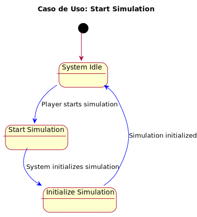
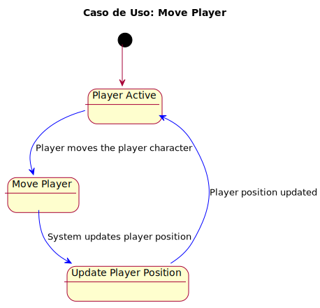
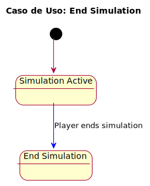
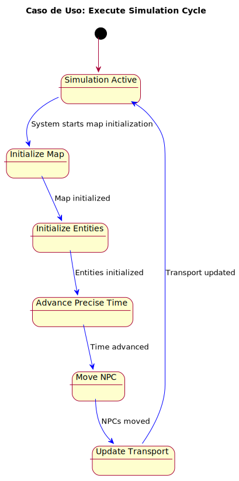
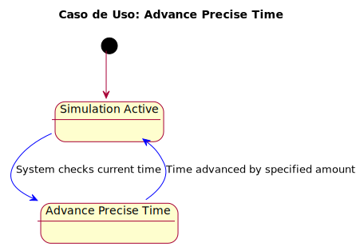
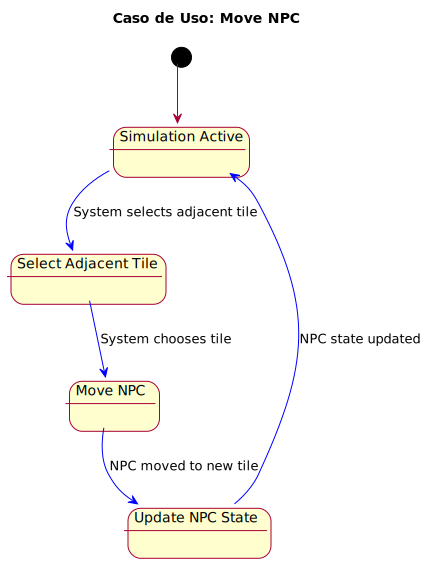
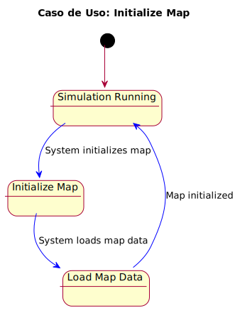
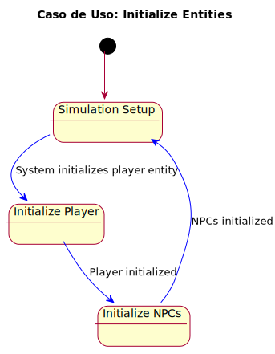

Este documento presenta los casos de uso identificados para nuestro proyecto, clasificados por actores y detallados con diagramas y códigos correspondientes.

## Índice
1. [Actores y Casos de Uso](#actores-y-casos-de-uso)
2. [Detalles de los Casos de Uso](#detalles-de-los-casos-de-uso)
3. [Diagramas de Contexto](#diagramas-de-contexto)

## Actores y Casos de Uso

### Actores Identificados
- **Player**
- **System**

### Casos de Uso por Actor
#### Player
- Start simulation
- Move player
- End simulation

#### System
- Execute simulation cycle
- Advance time
- Move NPC
- Initialize map
- Initialize entities
- Move transport

#### Diagrama General de Casos de Uso
  
[Código PUML](../modelosUML/diagramaCasosDeUso.puml)

---

## Detalles de los Casos de Uso

### Start simulation
  
[Código PUML](../casosDeUso/detalleDeCasosDeUso/startSimulation.puml)

---
### Move player
  
[Código PUML](../casosDeUso/detalleDeCasosDeUso/movePlayer.puml)

---

### End simulation
  
[Código PUML](../casosDeUso/detalleDeCasosDeUso/endSimulation.puml)

---

## Casos de Uso para System
### Execute simulation cycle
  
[Código PUML](../casosDeUso/detalleDeCasosDeUso/executeSimulationCycle.puml)

---

### Advance precise time
  
[Código PUML](../casosDeUso/detalleDeCasosDeUso/advancePreciseTime.puml)

---

### Move NPC
  
[Código PUML](../casosDeUso/detalleDeCasosDeUso/moveNPC.puml)

---

### Initialize map
  
[Código PUML](../casosDeUso/detalleDeCasosDeUso/initializeMap.puml)

---

### Initialize entities
  
[Código PUML](../casosDeUso/detalleDeCasosDeUso/initializeEntities.puml)

---

### Update transport
  
[Código PUML](../casosDeUso/detalleDeCasosDeUso/updateTransport.puml)

---

## Diagramas de Contexto
