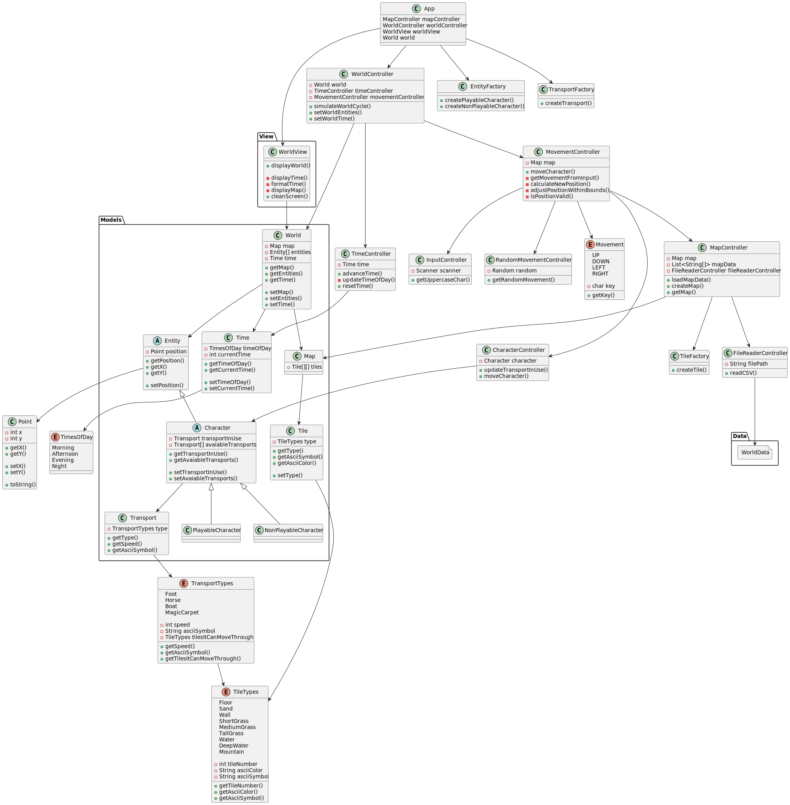
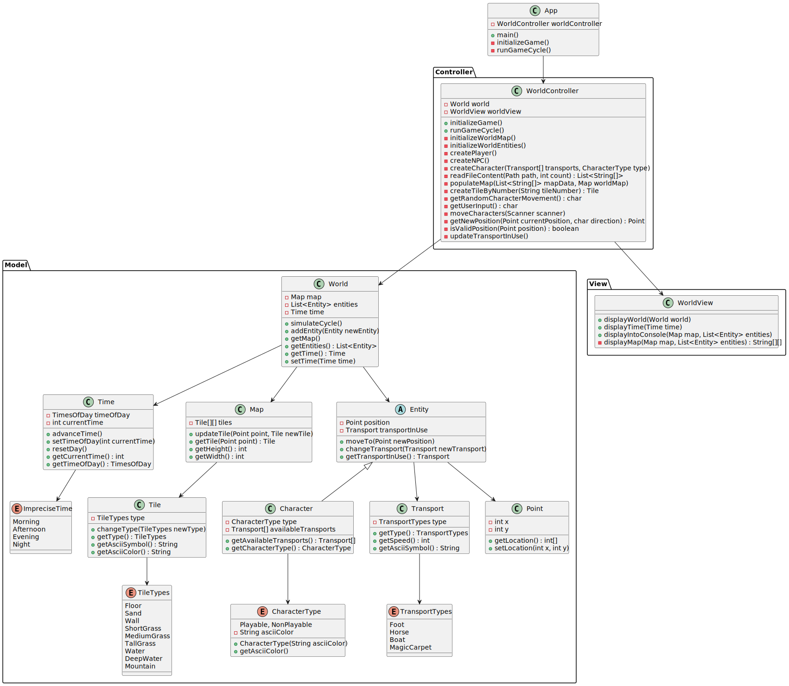
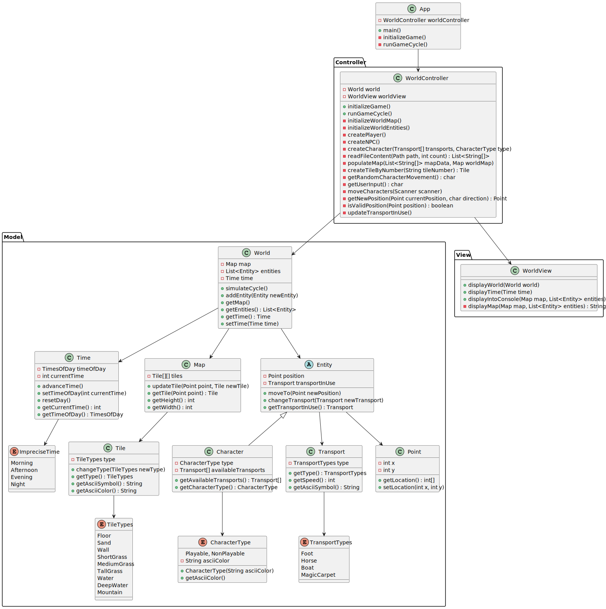

# Memoria del Proyecto El Mundo

## Imágenes de ClasesPracticas

### Versión Inicial
En la versión inicial, se añadieron las imágenes de ClasesPracticas que representaban los casos de uso básicos y las primeras implementaciones de las clases.
- **Commit:** [99a071a70c0c760b78c1e3a2f5536427a5419e9f]https://github.com/VeronikaEspa/23-24-IdSw2-SDD/commit/99a071a70c0c760b78c1e3a2f5536427a5419e9f)
- **Descripción:** "docs: Practical Classes Diagram".

### Versión Intermedia
En la versión intermedia, las imágenes de ClasesPracticas se actualizaron para reflejar las nuevas funcionalidades y mejoras en el diseño del sistema. Estos cambios se realizaron para asegurar que las imágenes estuvieran alineadas con el estado actual del proyecto.
- **Commit:** [ff5218f916ad2caba4b1525f54d692c470dac39e](https://github.com/VeronikaEspa/23-24-IdSw2-SDD/commit/ff5218f916ad2caba4b1525f54d692c470dac39e)
- **Descripción:** "Updated ClasesPracticas images" actualizando las imágenes de ClasesPracticas.

### Versión Final
En la versión final, se realizaron ajustes y optimizaciones en las imágenes de ClasesPracticas para garantizar que representaran con precisión la estructura y funcionalidad final del sistema. Esta versión final está lista para ser utilizada como referencia en la documentación del proyecto.
- **Commit:** [58d3ac246b5f75da15bf61e068630e554a0a7f70](https://github.com/VeronikaEspa/23-24-IdSw2-SDD/commit/58d3ac246b5f75da15bf61e068630e554a0a7f70)
- **Descripción:** "Final ClasesPracticas images" proporcionando las imágenes finales de ClasesPracticas. 
