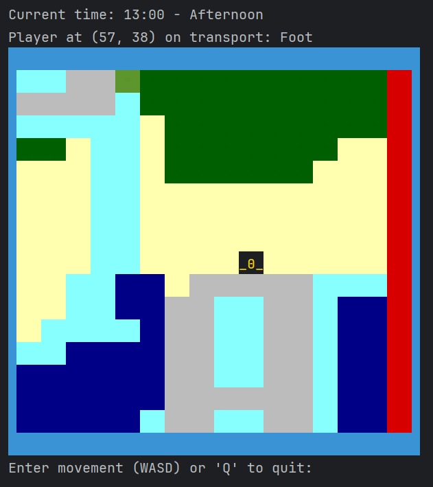
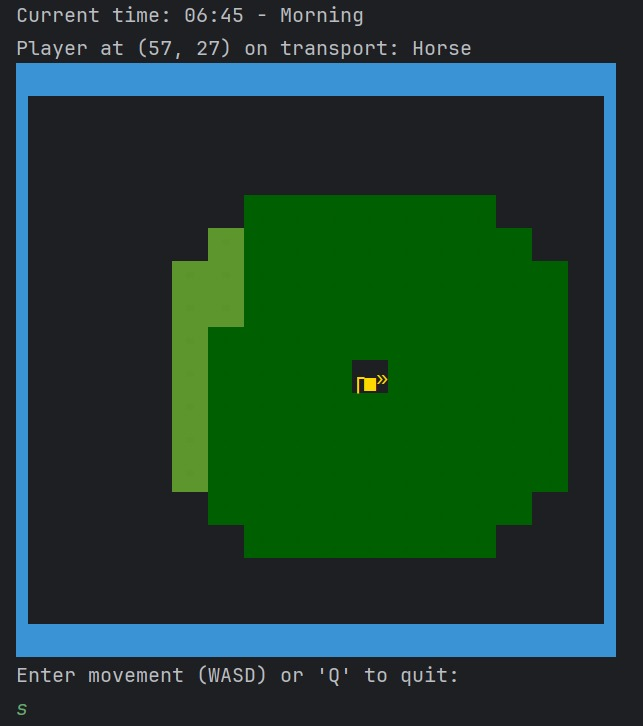
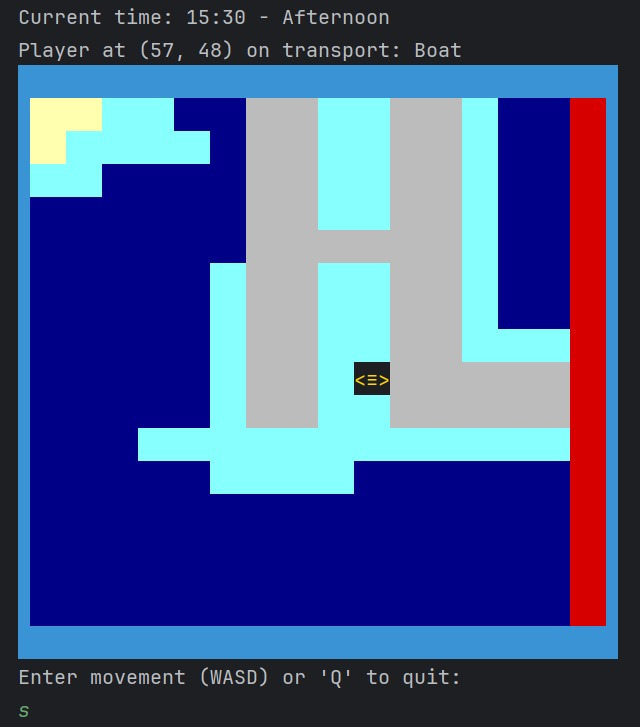
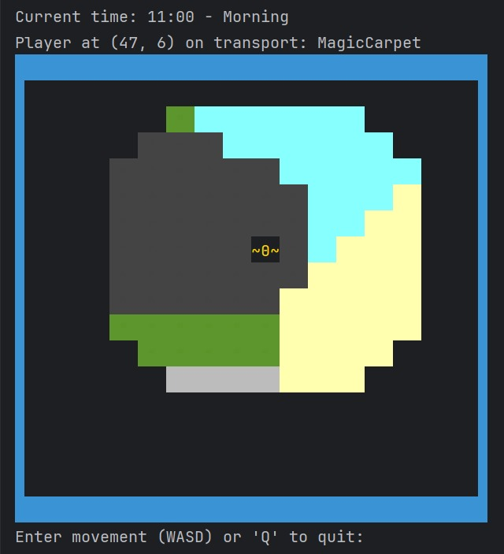

## Clases Prácticas

Este diagrama visualiza las interacciones típicas y los flujos de trabajo durante las sesiones prácticas del proyecto, destacando la dinámica de las clases y su aplicabilidad en contextos de aprendizaje real.

## Resultados de las Sesiones de Diseño

