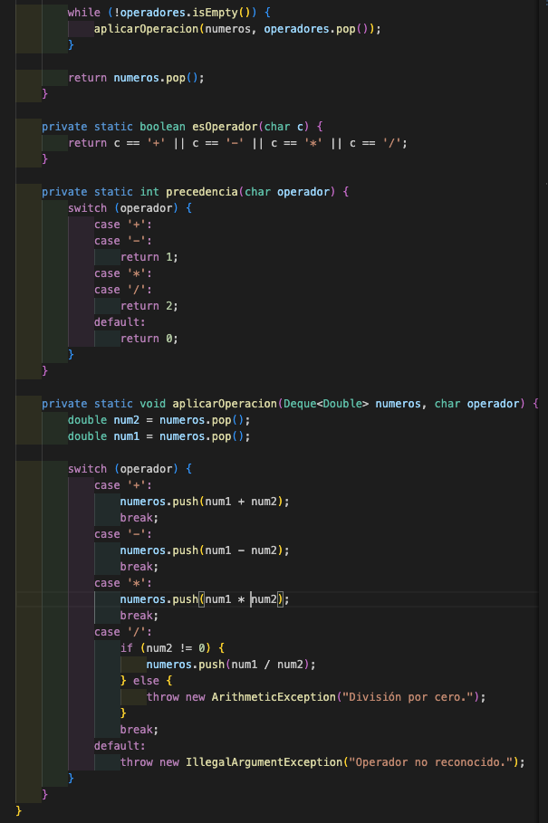
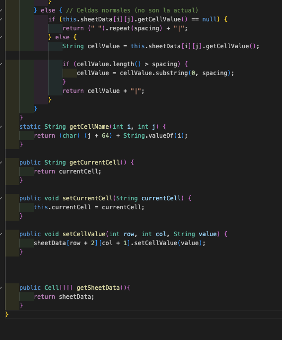

## Clase Cell

### **_¿Por qué?_**

La clase `Cell` se ha diseñado como una envoltura escalable para almacenar el valor de una celda dentro de una estructura que representa un tablero o una matriz. Originalmente, una celda podría haber sido simplemente un valor aislado sin contexto sobre su ubicación. Sin embargo, en aplicaciones que manejan estructuras más complejas, como hojas de cálculo, matrices o tableros de juego, es crucial conocer la posición de cada celda además de su contenido.

Este diseño permite que `Cell` no solo almacene un valor (su `cellValue`), sino también sus coordenadas (`x` y `y`), lo que facilita su integración en sistemas donde la posición de la celda es relevante.

### **_Qué cambiamos_**

En la versión original, ni siquiera se contemplaba hacer una clase a partir de este elemento; simplemente se consideraba como un string dentro de una matriz de strings.

Más tarde, la clase `Cell` se diseñó de esta manera:  para representar una celda simple sin coordenadas, con una implementación que solo almacenaba un valor de celda, sin considerar su posición. En la nueva implementación, se diseñó para representar una celda con coordenadas, útil para estructuras tipo matriz o tablero. Los atributos `x` y `y` son para las coordenadas, como se refleja en este archivo: [Cell.java](https://github.com/pablarce/23-24-IdSw2-SDD/blob/main/pyHojaDeCalculo/Utils/Model/Cell.java).

---

## Clase MathOperations

### **_¿Por qué?_**

La clase `MathOperations` muestra una moderada cohesión y acoplamiento. Depende de la clase `Sheet`, y el método [getCellValue](https://github.com/pablarce/23-24-IdSw2-SDD/blob/fead6900c7c9dcd2f1063ecd556f2c7d42b19b14/pyHojaDeCalculo/Utils/Model/MathOperations.java#L74) está acoplado a la implementación específica de `Sheet`. Su enfoque principal es la evaluación de fórmulas matemáticas simples, como se evidencia en los métodos [evaluateFormula](https://github.com/pablarce/23-24-IdSw2-SDD/blob/fead6900c7c9dcd2f1063ecd556f2c7d42b19b14/pyHojaDeCalculo/Utils/Model/MathOperations.java#L8), [evaluateExpression](https://github.com/pablarce/23-24-IdSw2-SDD/blob/fead6900c7c9dcd2f1063ecd556f2c7d42b19b14/pyHojaDeCalculo/Utils/Model/MathOperations.java#L22) y en los métodos privados [isOperator, precedence y applyOperation](https://github.com/pablarce/23-24-IdSw2-SDD/blob/fead6900c7c9dcd2f1063ecd556f2c7d42b19b14/pyHojaDeCalculo/Utils/Model/MathOperations.java#L85). Todos estos métodos comparten una responsabilidad unificada, ya que colaboran para encontrar el resultado de una fórmula matemática. Además, es escalable, ya que la adición de nuevas operaciones solo requiere insertar otro caso en un switch, junto con la lógica de cálculo correspondiente.

La clase cumple con el principio S (Single Responsibility Principle) al concentrarse principalmente en el cálculo de operaciones matemáticas simples. Sin embargo, el método [getCellValue](https://github.com/pablarce/23-24-IdSw2-SDD/blob/fead6900c7c9dcd2f1063ecd556f2c7d42b19b14/pyHojaDeCalculo/Utils/Model/MathOperations.java#L74) podría considerarse una responsabilidad adicional que compromete parcialmente este principio, aunque su uso se limita a esta clase y su extracción podría fragmentar el proyecto. Además, la clase es parcialmente compatible con el principio O (Open/Closed Principle), ya que está abierta a la extensión mediante la adición de nuevos operadores.

### **_Qué cambiamos_**

El primer modelo de `MathOperations` se diseñó con el fin de evaluar expresiones matemáticas sin referencias, es decir, no manejaba referencias a celdas, solo números y operadores en la expresión, como se puede observar: , . En la nueva implementación, se incluye un método que toma una fórmula y un objeto `Sheet`, evalúa expresiones que pueden incluir referencias a celdas de una hoja de cálculo, y utiliza el objeto `Sheet` para obtener los valores de celdas referenciadas en la expresión. Esto permite interpretar referencias a celdas (por ejemplo, A1) y obtener sus valores correspondientes, como se muestra en [MathOperations.java](https://github.com/pablarce/23-24-IdSw2-SDD/blob/main/pyHojaDeCalculo/Utils/Model/MathOperations.java).

---

## Clase Sheet

### **_¿Por qué?_**

La clase `Sheet` presenta un bajo acoplamiento y una moderada cohesión. `Sheet` maneja su lógica interna y no depende directamente de otras clases más allá de `Settings`. Su cohesión es moderada porque se enfoca en la gestión y manipulación de los datos de la hoja de cálculo, como se observa en métodos como [fillSheetData](https://github.com/pablarce/23-24-IdSw2-SDD/blob/fead6900c7c9dcd2f1063ecd556f2c7d42b19b14/pyHojaDeCalculo/Utils/Model/Sheet.java#L16), [getCellContent](https://github.com/pablarce/23-24-IdSw2-SDD/blob/fead6900c7c9dcd2f1063ecd556f2c7d42b19b14/pyHojaDeCalculo/Utils/Model/Sheet.java#L24) y [setCellValue](https://github.com/pablarce/23-24-IdSw2-SDD/blob/fead6900c7c9dcd2f1063ecd556f2c7d42b19b14/pyHojaDeCalculo/Utils/Model/Sheet.java#L67). Estos métodos tienen responsabilidades claramente definidas y trabajan de manera independiente pero coordinada para manipular y gestionar los datos de la hoja de cálculo de forma eficiente.

Además, `Sheet` cumple con varios principios SOLID de diseño de software. El principio L (Liskov Substitution Principle) se cumple al no tener subclases directas y al estar diseñada de manera que no requiere ser extendida directamente para añadir funcionalidad. Respecto al principio I (Interface Segregation Principle), la clase no implementa interfaces genéricas innecesarias, sino que proporciona métodos específicos que se enfocan claramente en procesar y gestionar los datos en la hoja de cálculo. Finalmente, sigue el principio S (Single Responsibility Principle) al dedicarse exclusivamente a la manipulación de datos de la hoja de cálculo, asegurando que cada método tenga una tarea específica y claramente definida para lograr su propósito principal de manera eficiente.

### **_Qué cambiamos_**

Inicialmente, la clase `Sheet` se diseñó usando un valor constante de espaciado (`spacing`) de 8, lo cual permitía llamar al constructor `Cell` y mostrar celdas seleccionadas con corchetes (`[]`) si era la celda actual. Utilizaba un tamaño de celda fijo definido por `spacing`, luego asignaba el valor a una celda ajustando las coordenadas dadas (`row + 2` y `col + 1`), como se muestra aquí: , .

Posteriormente, se ajustó para proporcionar una estructura más ajustable y flexible en términos de tamaño de celdas y manejo de la posición actual de la celda, permitiendo asignar el valor a una celda directamente mediante las coordenadas dadas, como se puede ver en [Sheet.java](https://github.com/pablarce/23-24-IdSw2-SDD/blob/main/pyHojaDeCalculo/Utils/Model/Sheet.java).

---

## Clase Spreadsheet

### **_¿Por qué?_**

La idea de hacer una clase llamada SpreadSheet separada de Sheet, era para encapsular correctamente cada uno de los elementos que conformaban la hoja de calculo. Como el gestor de operaciones matemáticas, o el menu, y mantenerla aislado de la hoja en si misma.

La clase `Spreadsheet` muestra un alto acoplamiento debido a su estrecha dependencia de varias clases clave como `Navigator`, `Settings`, `Viewport`, `MenuInterface` y `MathOperations`. Estas dependencias son fundamentales porque `Spreadsheet` contiene la lógica central de la hoja de cálculo, siendo responsable de coordinar y ejecutar todas las operaciones principales que se realizan en la aplicación. Un ejemplo concreto se observa al querer cambiar el valor de una celda, como se evidencia en las líneas [38 a 40](https://github.com/pablarce/23-24-IdSw2-SDD/blob/fead6900c7c9dcd2f1063ecd556f2c7d42b19b14/pyHojaDeCalculo/Utils/Model/Spreadsheet.java#L38). En este proceso, `Spreadsheet` transfiere la entrada del usuario a `MathOperations`, donde se realizan

### **_Qué cambiamos_**

Inicialmente, la clase `Spreadsheet` se diseñó para manejar la lógica de la hoja de cálculo, incluyendo la creación de la hoja, la navegación, la gestión de la vista y la interacción con el usuario. Se diseñó para ser una clase principal que coordinara todas las operaciones de la hoja de cálculo. Posteriormente, se ajustó para proporcionar una estructura más ajustable y flexible en términos de tamaño de celdas y manejo de la posición actual de la celda, permitiendo asignar el valor a una celda directamente mediante las coordenadas dadas.
